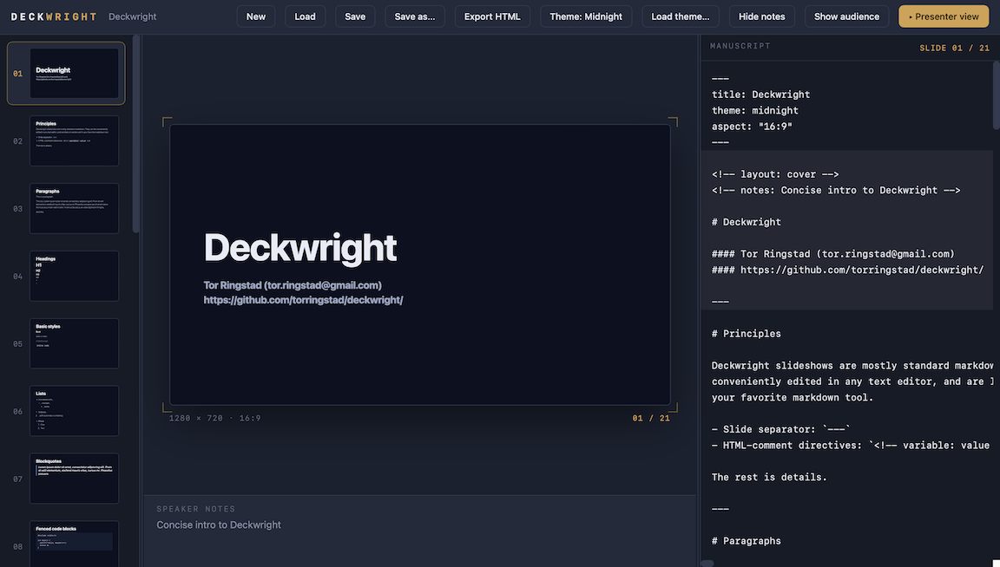
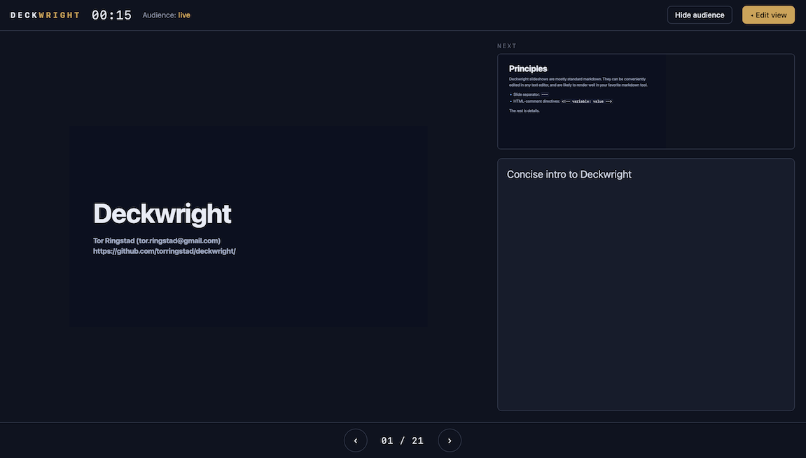
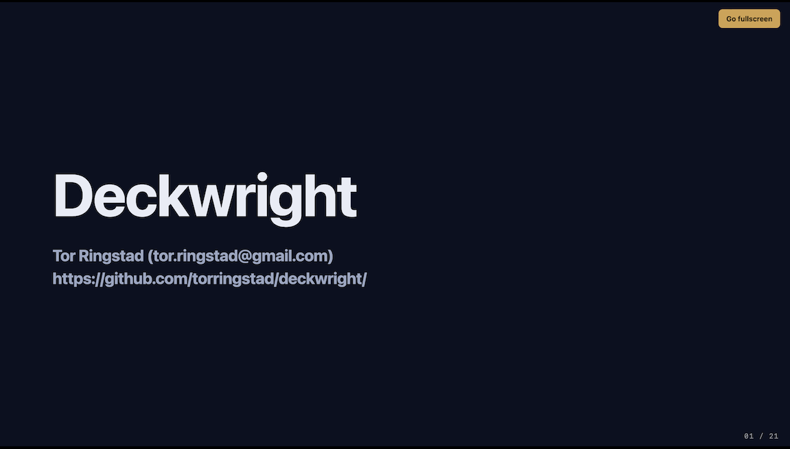

# Deckwright

A slide deck tool in a single HTML file. Write your deck as plain markdown,
present it from the same page, export it as a self-contained static page.
No build step, no dependencies.

## Getting started

Some alternatives:

- Check out from GitHub: 
  - `git clone git@github.com:torringstad/deckwright.git`
  - `https://github.com/torringstad/deckwright.git` 

- Download
[deckwright.html](https://github.com/torringstad/deckwright/blob/main/deckwright.html)
and put it anywhere your browser can reach it.

- Live demo: https://www.pvv.ntnu.no/~torhr/deckwright/deckwright.html

The live demo will automatically open the intro-document
([deckwright_intro.md](https://github.com/torringstad/deckwright/blob/main/deckwright_intro.md),
[gallery](deckwright_intro_gallery),
[html](deckwright_intro.html)).

## Development status

The project have plenty rough edges, but should definitely be usable.

To a certain degree, flexibility has been prioritised over absolute
robustness. An effort has been made to make it hard to break things by
accident, but you will definitely be able to break things if you try (in
particular with creative CSS in themes).

Did I mention responsive design? No? Good!

## Alternatives

[Deckless](https://deckless.app) is a professional and polished product
with similar design philosophy and a rich feature set.

Compared to **Deckless**, **Deckwright** is open source, server-less,
registration-less, locally installable and compact.

## Creating presentations with AI assistance

The file [deckwright-authoring-guide.md](deckwright-authoring-guide.md) 

